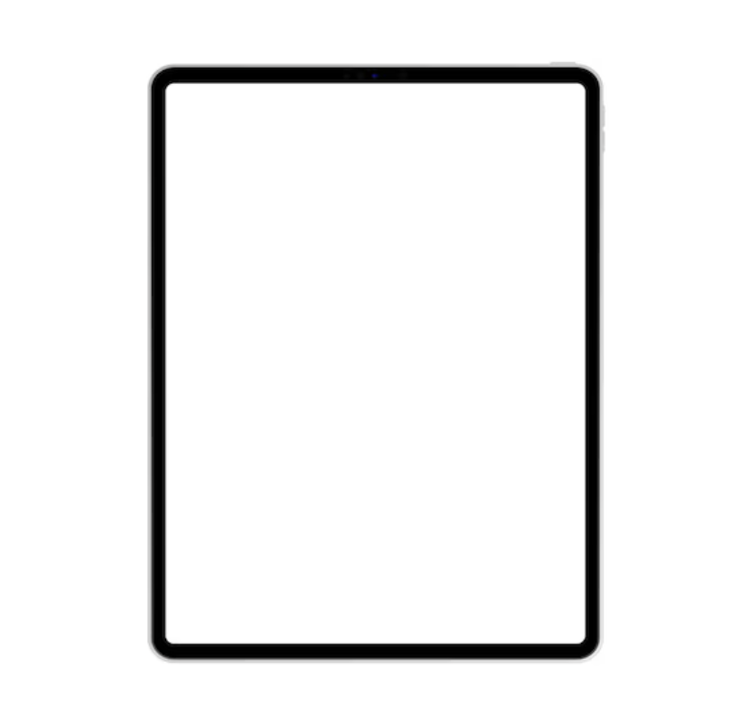
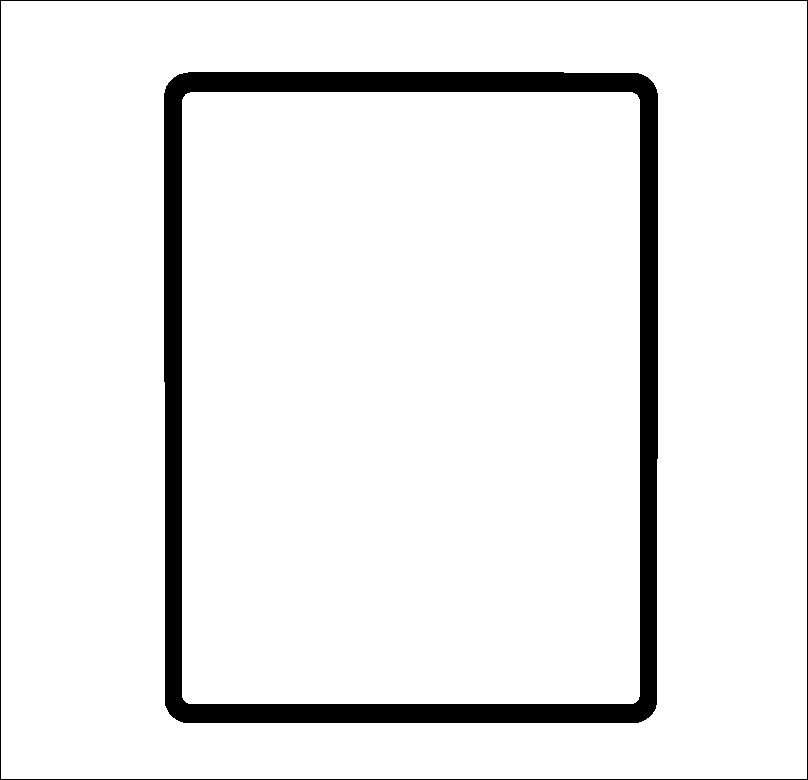
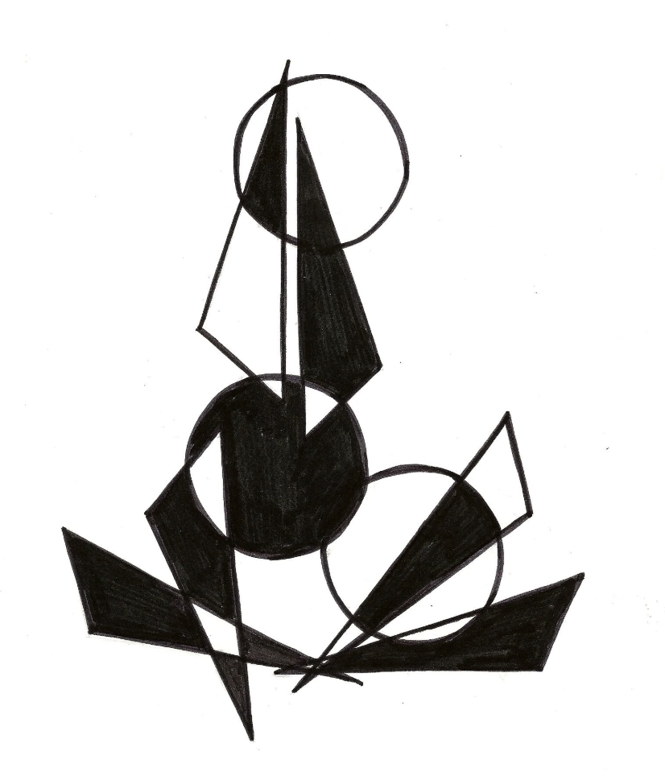
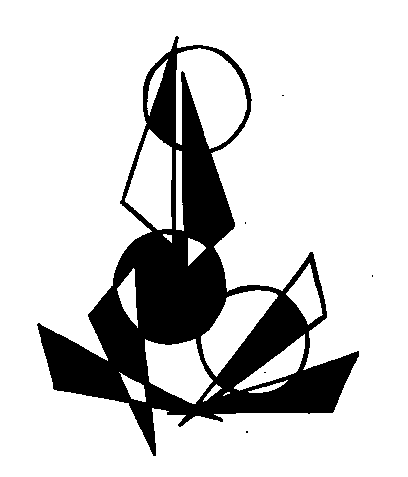
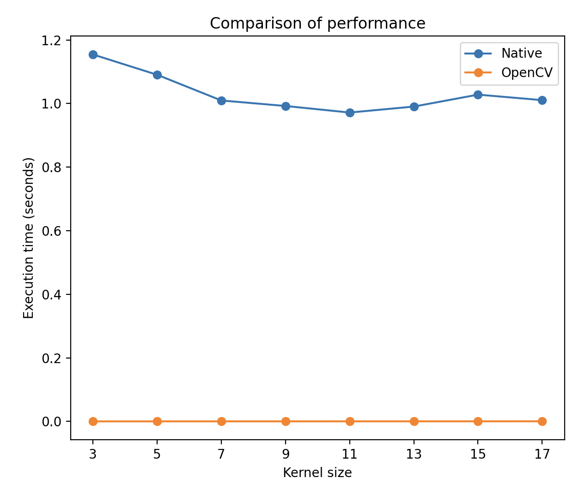

## Лабораторная работа №1
- ФИО: Смирнов Евгений Александрович
- Группа: P4222
- Предмет: Компьютерное зрение 
- Лабораторная работа: Реализация алгоритма морфологической обработки изображений 
- Вариант: №7 — Эрозия

### 1. Теоретическая база
Морфологические операции — это класс методов обработки изображений, ориентированных на анализ и изменение формы объектов.
Они широко применяются в задачах компьютерного зрения, сегментации, удаления шума и предварительной обработки изображений.

Морфологическая эрозия — это операция, которая уменьшает белые (значимые) области бинарного изображения.
Пиксель остаётся белым только в том случае, если все пиксели структурного элемента, наложенного на него, также являются белыми.

Эрозия применяется для:
- удаления мелкого шума;
- разрыва узких соединений; 
- уменьшения размеров объектов; 
- подготовки изображения к последующим морфологическим операциям.

В данной работе используется структурный элемент размером 3×3, представляющий собой квадрат, заполненный единицами.

### 2. Описание алгоритма
Алгоритм морфологической эрозии с использованием структурного элемента 3×3 выполняется следующим образом:
1. Входное изображение переводится в оттенки серого.
2. Выполняется бинаризация изображения (с использованием встроенных средств библиотеки).
3. Для каждого пикселя изображения (за исключением граничных):
   1. выбирается окно размером 3×3 с центром в текущем пикселе; 
   2. если все значения в окне равны белому (255), то текущий пиксель выходного изображения устанавливается в белый цвет; иначе пиксель устанавливается в чёрный цвет. 
4. Результат сохраняется в виде нового бинарного изображения.

### 3. Сравнение быстродействия двух подходов.
В работе реализованы два варианта алгоритма:
- с использованием функции cv2.erode() библиотеки OpenCV; 
- нативная реализация на Python с использованием циклов и операций над массивами.

Пример изображения и результат работы

| # | Изображение до               | erosion_native                      | openCV                              |
|---|------------------------------|-------------------------------------|-------------------------------------|
| 1 |    |    |    |
| 2 |  |  |  |
| 3 |            |            |            |

Далее на одном и том же изображении был выполнен расчет времени для разного размера ядра и построен график. 

**Результаты выполнения (лучший результат):**   
OpenCV cv2.erode: 0.00010 сек.   
Ручная эрозии: 0.972 сек.   

Вывод: 
В ходе выполнения лабораторной работы была реализована морфологическая операция эрозии бинарного изображения с использованием структурного элемента размером 3×3. Алгоритм был реализован в двух вариантах: нативно на языке Python и с использованием библиотечной функции cv2.erode() из OpenCV.

Для оценки производительности был проведён эксперимент, в котором измерялось время выполнения алгоритмов при различных размерах структурного элемента. 
Анализ результатов показал, что:
- нативная реализация эрозии на Python работает значительно медленнее из-за использования вложенных циклов и отсутствия низкоуровневых оптимизаций;
- время выполнения нативного алгоритма остаётся на уровне около 1 секунды
- библиотечная реализация OpenCV демонстрирует существенно более высокую производительность, достигая времени выполнения порядка 0.0001 секунды

### Список источников
1. https://docs.opencv.org/3.4/db/df6/tutorial_erosion_dilatation.html - официальная документация OpenCV
