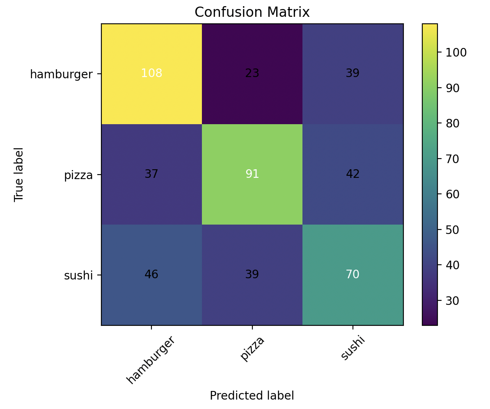

## Лабораторная работа №3

ФИО: Смирнов Евгений Александрович  
Группа: P4222  
Предмет: Компьютерное зрение  
Лабораторная работа: Классификация изображений с использованием сверточных нейронных сетей  

---

### 1. Теоретическая база

Сверточные нейронные сети (Convolutional Neural Networks, CNN) широко применяются
для задач компьютерного зрения, таких как классификация изображений, детекция и сегментация объектов.

Идея CNN заключается в автоматическом извлечении признаков из изображений
с помощью сверточных слоёв. Основные компоненты CNN:

- Сверточные слои (Conv2D) — выделяют локальные признаки (границы, текстуры, формы);
- Функции активации (ReLU) — добавляют нелинейность в модель;
- Pooling-слои (MaxPooling) — уменьшают размерность признаков и повышают устойчивость к сдвигам;
- Полносвязные слои (Fully Connected) — используются для финальной классификации;
- Функция потерь (Loss Function) — оценивает ошибку предсказания модели;
- Оптимизатор — обновляет веса модели для минимизации функции потерь.

---

### 2. Архитектура программы

Разработанная система классификации изображений состоит из следующих компонентов:

- Модуль загрузки и предобработки изображений
- Сверточная нейронная сеть
- Модуль обучения модели
- Модуль оценки качества классификации

#### Архитектура нейронной сети:

| Слой | Описание |
|-----|----------|
| Conv2D | 32 фильтра, ядро 3×3 |
| ReLU | Функция активации |
| MaxPooling2D | 2×2 |
| Conv2D | 64 фильтра, ядро 3×3 |
| ReLU | Функция активации |
| MaxPooling2D | 2×2 |
| Flatten | Преобразование в вектор |
| Linear | Полносвязный слой |
| Softmax | Вероятности классов |

#### Используемые параметры:
- Loss: CrossEntropyLoss
- Оптимизатор: Adam
- Метрика качества: Accuracy

---

### 4. Результаты

В ходе работы модель была обучена на датасете [Food-101](https://www.kaggle.com/datasets/dansbecker/food-101).
Было отобрано три класса: 
1. [суши](data/train/sushi)
2. [пицца](data/train/pizza)
3. [гамбургеры](data/train/hamburger)

#### Динамика обучения модели
| Эпоха | Train Loss | Val Loss | Val Accuracy |
|------:|-----------:|---------:|-------------:|
| 1 | 1.4002 | 1.0992 | 0.3287 |
| 2 | 1.0956 | 1.0845 | 0.4157 |
| 3 | 1.0605 | 1.0383 | 0.4824 |
| 4 | 0.9881 | 1.0762 | 0.4574 |
| 5 | 0.9489 | 1.0278 | 0.4796 |
| 6 | 0.8953 | 0.9678 | 0.5481 |
| 7 | 0.7909 | 0.9592 | 0.5583 |
| 8 | 0.7342 | 1.0251 | 0.5574 |
| 9 | 0.6432 | 1.0126 | 0.5583 |
| 10 | 0.5122 | 1.0776 | 0.5657 |
В процессе обучения наблюдается монотонное снижение значения функции потерь
на обучающей выборке, что свидетельствует о корректной оптимизации модели

Оценка качества модели проводилась на тестовой выборке, собранной и размеченной вручную и содержащей 495 изображений.

#### Метрики по классам

| Класс | Precision | Recall | F1-score |
|------|-----------|--------|----------|
| Hamburger | 0.57      | 0.64   | 0.60     |
| Pizza | 0.59      | 0.53   | 0.56     |
| Sushi | 0.46      | 0.45   | 0.46     |

Общая точность классификации (Accuracy) составила **54.34%**, что существенно превышает уровень случайного угадывания для задачи с тремя классами (≈33%).

#### Матрица ошибок

Матрица ошибок (Confusion Matrix) представлена на рисунке ниже.
По вертикальной оси отложены истинные классы (True label),
по горизонтальной — предсказанные моделью классы (Predicted label).

На диагонали матрицы расположены корректные предсказания, вне диагонали — ошибки классификации.

### Интерпретация результатов предсказаний
Наилучшее качество классификации показал класс *hamburger*, для которого получено наибольшее значение F1-score (0.60). Модель достаточно хорошо обнаруживает изображения данного класса, однако допускает некоторое количество ложных срабатываний.

Для класса *pizza* значения точности и полноты находятся на сопоставимом уровне, что свидетельствует о стабильном, но менее выраженном качестве распознавания.

Класс *sushi* оказался наиболее сложным для модели, что подтверждается наименьшими значениями всех метрик качества.  

---

### 5. Выводы по работе

В ходе лабораторной работы была реализована простая система классификации изображений
на основе сверточной нейронной сети.

Были получены практические навыки:
- работы с изображениями;
- построения и обучения CNN;
- оценки качества модели;
- анализа переобучения.

Разработанная модель демонстрирует удовлетворительное качество классификации
и может быть улучшена за счёт увеличения объёма данных, применения аугментаций
и более сложных архитектур.

---

### 6. Список источников
1. https://pytorch.org/docs/stable/index.html
2. https://www.kaggle.com/